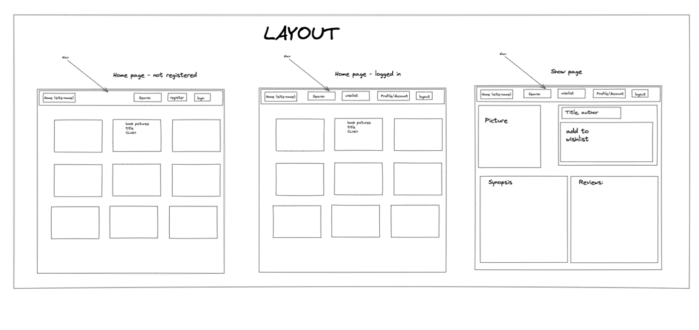
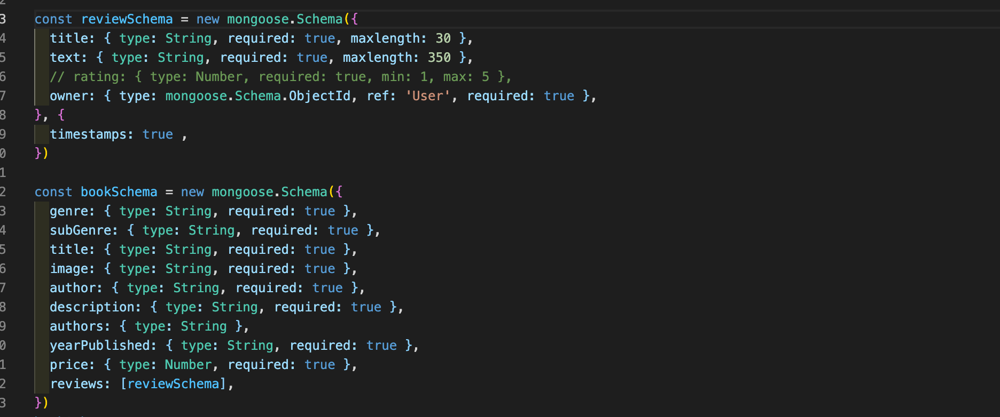
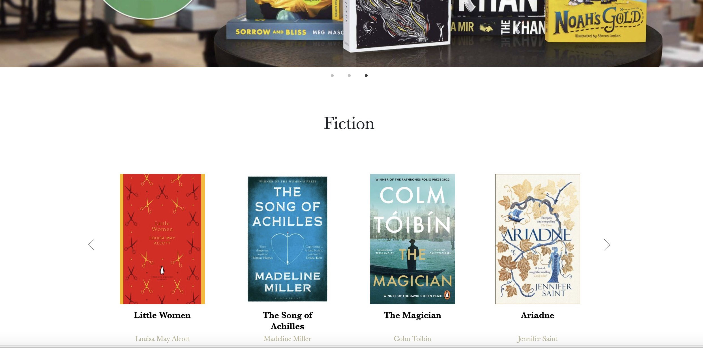

# 
# Book - project 3
## 1 week group project
---
## Brief
For our third project at General Assembly, we were asked to build a full-stack web application by building our own front and back-end, we were paired in a group of 3 and given 7 days to complete the project.
Our idea was to create a book app in which the user can register and leave reviews and save items in a wishlist.

## Project link
link

## Tech list
#### Front-end

* HTML
* SASS
* JavaScript
* React

#### Back-end
* Node.js
* MongoDB

#### Database
* NoSQL

#### Development tools
* Insomnia
* Git
* GitHub

---

## Planning
Once we decided the project's theme and where to get our books' data, we moved on doing a wireframe on excalidraw.com. 
So we tried to figure out which features to have and how to achieve them. 

Next we decided the role that each one would have. 
My main tasks were to start the backend, do the homepage and the reviews 

## Build process
### Back-end

We decided to do the back-end togheter and then split the roles in the front-end part. 
So once the set up and the database were ready, we started doing the models, the router and the controllers.  

Our controllers included the GET methods for the books and the GET, POST and PUT method for authentication and for updating user credentials.

### Front-end
My first task in the front-end part was to make the home page, which was quite challenging because of the carousels. 
I managed to find a good slider package called react-slick. It was quite simple to use but dificult to customize. 

After that I coded the reviews so that once posted they would show the owner's name, the title of the comment and the text. Then I provided a "delete-review" button that appears only if you are the owner of that review. 

# Wins 

- **Carousels:** I was able to find a solution to make sliders with multiple elements

- **Reviews:** being able to figure out how to immediately show reviews with the owner by calling, at the time of submit, both the POST and the GET method

# Challenges

- **Carousels:** It was pretty difficult to customize the style of the carousels. 

- **Reviews:** It was difficult to understand why the username did not immediately appear in the review and generated an error.

## Key learnings

In addition to having gained more confidence with programming, I feel I have learned something more about working in group. I think a mistake we made was not having a leader with clear ideas to lead the group and choose what to do and what not to do. Some roles weren't well defined and we ended up with some features that didn't work one hundred percent, messy code, and sloppy style. 

## Potential future features
- **Make the app responsive**
- **User's profile image**
- **Improve the style**
